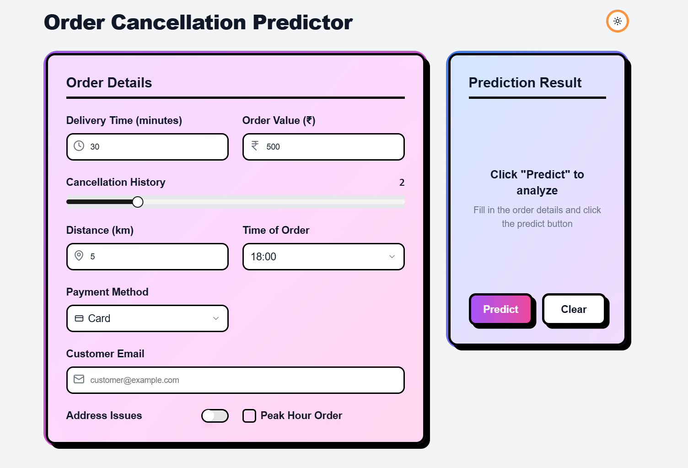
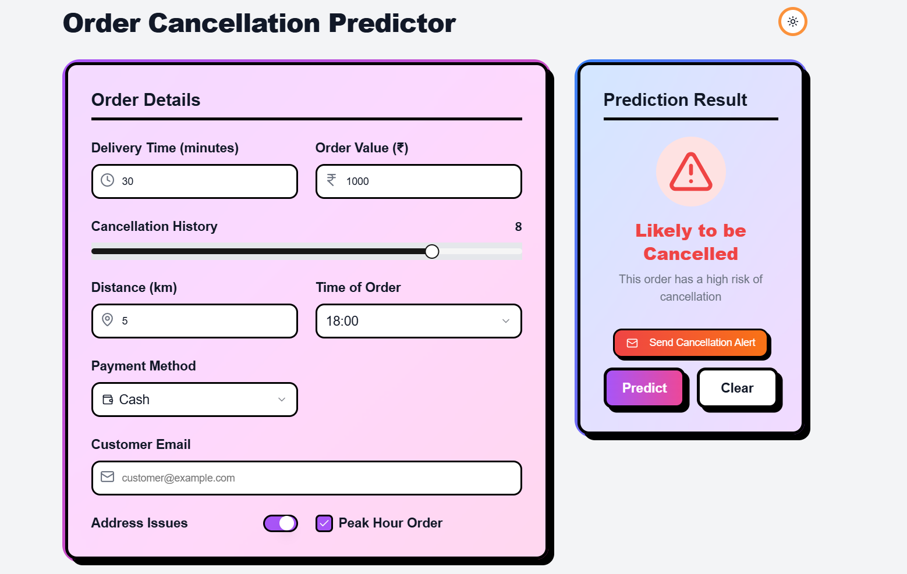
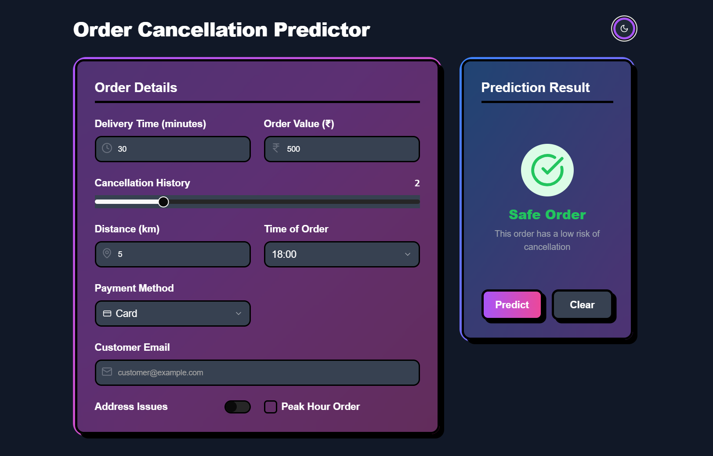
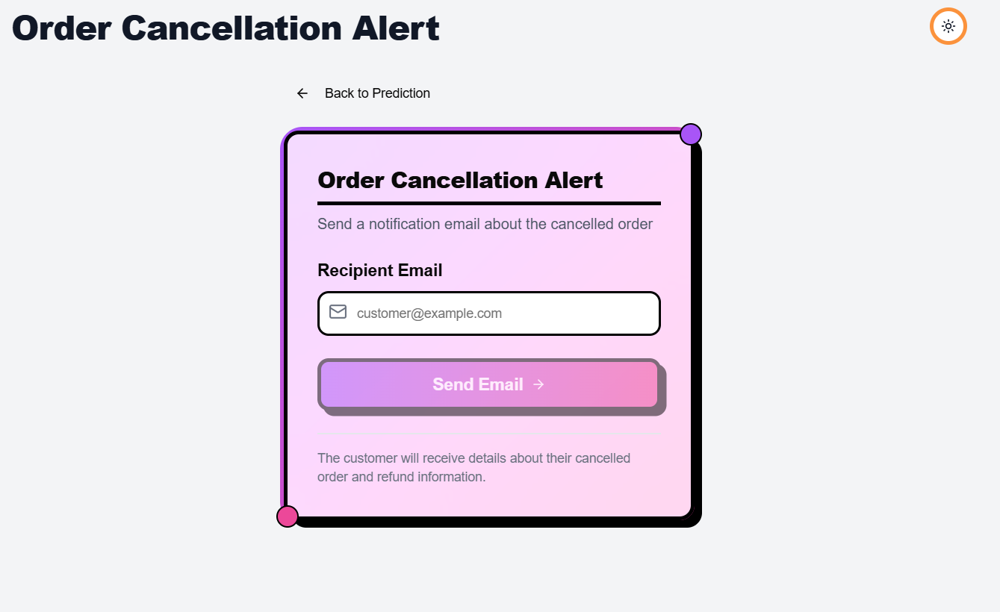

# 🚀 OrderGuard - Order Cancellation Predictor

**OrderGuard** is a smart ML-based system that predicts whether a food delivery order might get cancelled. It analyzes key parameters like delivery time, value, customer history, and other order-specific data to flag high-risk orders and help reduce cancellations proactively.

---

## 📷 Screenshots

### 🖼️ Main UI Interface


### 🚨 High-Risk Prediction


### ✅ Safe Order Prediction


### 📩 Email Notification Trigger


---

## 📌 Features

- 🔍 Predicts order cancellation risk using trained ML model
- ⚙️ Flask-based backend with `/predict` endpoint
- 📤 API ready to integrate with any frontend (React / v0.dev)
- 📧 Optional email notification system for flagged orders
- 🧪 Includes client-side script for API testing (`test_client.py`)
- 🌐 CORS-enabled backend for cross-origin frontend requests
- 🧠 Smart feature-based prediction using delivery & customer behavior

---

## 🧠 Machine Learning Model

This project uses a **Random Forest Classifier** trained on labeled historical order data with the following features:

- `delivery_time`
- `order_value`
- `cancellation_history`
- `distance`
- `time_of_order`
- `payment_method`
- `address_issues`
- `peak_hour_order`

The model is trained using scikit-learn and serialized with `pickle` for fast loading in production. The output is a binary prediction: `1` = High risk, `0` = Safe.

---

## 🛠️ Tech Stack

- **Backend**: Python, Flask, Flask-CORS
- **ML**: scikit-learn, NumPy, Pandas
- **Frontend**: React.js / v0.dev UI
- **Testing**: Python requests module (`test_client.py`)
- **Email**: Flask-Mail (optional email alert)

---

## 🧪 Sample Input

```json
{
  "delivery_time": 30,
  "order_value": 500,
  "cancellation_history": 2,
  "distance": 10,
  "time_of_order": 14,
  "payment_method": 1,
  "address_issues": 0,
  "peak_hour_order": 1
}
```

## 📤 Sample Output
```json
{
  "cancel_prediction": 1
}
```

---

## 🚀 How to Run Locally

```bash
# 1. Clone the repository
https://github.com/ayushh0406/order-cancellation-predictor.git

# 2. Navigate to backend folder (if separated)
cd backend

# 3. Install dependencies
pip install -r requirements.txt

# 4. Run the Flask server
python app.py

# 5. (Optional) Test prediction
python test_client.py
```

---


